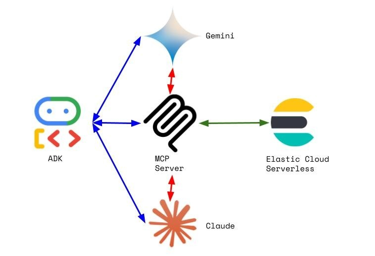

# Elastic Serverless + GCP ADK
## Contents
1.  [Summary](#summary)
2.  [Architecture](#architecture)
3.  [Features](#features)
4.  [Prerequisites](#prerequisites)
5.  [Installation](#installation)
6.  [Usage](#usage)

## Summary <a name="summary"></a>
This demonstrates an integration between the GCP Agent Development Kit (ADK) and Elastic Cloud Serverless via MCP.  An experimental Elastic MCP server is utilized with five stock tools.  ADK agents are configured for Gemini and Claude.

## Architecture <a name="architecture"></a>
  

## Features <a name="features"></a>
- Builds an Elastic Serverless project via Bash scripting
- Populates an index in that project with song data
- Integrates a local Docker-based MCP server to the Serverless project
- Integrates ADK agents to that MCP server and to the Gemini and Claude LLMs
- Deletes all the above via Bash scripting

## Prerequisites <a name="prerequisites"></a>
- Elastic Cloud account and API key
- GCP Project + Gemini API key
- Anthropic API key

## Installation <a name="installation"></a>
- Edit the elastic.env.template file and rename to elastic.env
- Edit the .env.template files in each of the agent directories and rename to .env
- Create a Python virtual environment and install the requirements.txt

## Usage <a name="usage"></a>
### Start Up
```bash
./start.sh
```
### Shut down
```bash
./stop.sh
```