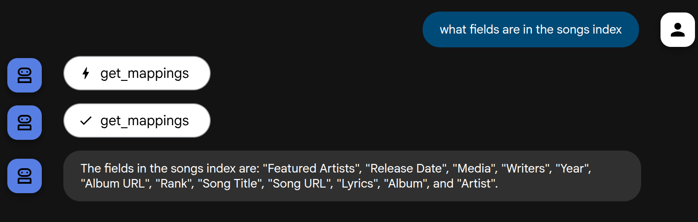

In this article, I demonstrate the integration of [Elastic Cloud Serverless](https://www.elastic.co/docs/api/doc/elastic-cloud-serverless/) with the [GCP Agent Development Kit](https://google.github.io/adk-docs/)(ADK).  

I'm using an 'experimental' [Elastic MCP server](https://github.com/elastic/mcp-server-elasticsearch) for this integration.  It provides five stock tools for search and system introspection.  Of note, Elastic will be releasing its own Agentic framework in the near future.  It will offer the functionality demonstrated here with ADK plus much more: integrated MCP server, tool creation, agent creation, and evaluation - all from Kibana.

# Architecture 
This demo is constructed to be run off a laptop.  
- The Elasticsearch component is cloud.  Specifically, the Serverless product is utilized here.  
- The MCP server runs from a local Docker container.
- ADK also runs locally but requires a GCP project + key.
- The LLMs (Gemini, Claude) are obviously cloud-based.

 

# Components
This demo is built entirely in shell script.  Below, I step through the start-up of the components.

## Create Serverless Project 
The Bash script below will build a serverless project [REST API](https://www.elastic.co/docs/api/doc/elastic-cloud-serverless/operation/operation-createelasticsearchproject) via curl.  It also assigns values that will be used later as shell variables.
```bash
    read -r PROJECT_ID ES_URL ES_USERNAME ES_PASSWORD < <(echo $(curl -s -X POST $ES_SERVERLESS_URL \
        -H "Authorization: ApiKey $ES_SERVERLESS_API_KEY" \
        -H "Content-Type: application/json" \
        -d '{
        "name": "demo-project",
        "region_id": "gcp-us-central1",
        "optimized_for": "general_purpose"
        }' | jq -r '.id, .endpoints.elasticsearch, .credentials.username, .credentials.password'))
```

## Load data into Elasticsearch
Bash scripting below to convert the included Kaggle songs JSON data set into NDJSON and subsequently bulk load that file into the Elastic Serverless project built previously.

```bash
jq -c -r --arg index_name $INDEX_NAME '.[] | {"index": {"_index": $index_name}}, .' "$JSON_FILE" > bulk_payload.json
curl -s -X POST $ES_URL/_bulk \
-H "Content-Type: application/x-ndjson" \
-H "Authorization: ApiKey $ES_API_KEY" \
--data-binary "@bulk_payload.json" > /dev/null
```

## Start Elastic MCP Server
Below a Docker container is started locally with the Elastic MCP server.
 
```bash
docker run --rm -d -p 8080:8080 -e ES_URL -e ES_API_KEY --name mcp docker.elastic.co/mcp/elasticsearch http
```

## Start ADK 
The command below starts up the ADK server with a UI and opens a Chrome browser session to that UI.

```bash
nohup adk web agents > /dev/null 2>&1 &
google-chrome http://localhost:8000 &
```

# Sample Results
Below are some screenshots from the ADK UI depicting use of the Gemini and Claude agents against the Elastic MCP server.

## Gemini - Fetch Indices


## Gemini - Show Mappings


## Gemini - Summarization


## Claude - Document Count


## Claude - DSL Query


## Claude - ES|QL Query


# Source
https://github.com/joeywhelan/es-adk